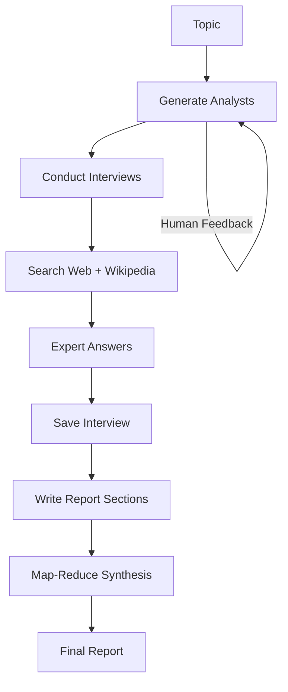

# Inquiro

Inquiro is a **research automation framework** that combines **AI-powered analyst personas**, **parallelized expert interviews**, and **map-reduce style synthesis** to generate structured reports from diverse sources. It allows human-in-the-loop feedback to refine analyst personas and ensures reliable, multi-perspective insights.

---

## Features

- **Analyst Generation**  
  - Dynamically generates AI analyst personas around sub-topics.  
  - Supports **human feedback** to refine analyst roles and perspectives.  

- **Research Automation**  
  - Analyst-driven interviews with automated question-answer cycles.  
  - Integrates **external sources** (Web Search, Wikipedia) for evidence-backed responses.  

- **Interview Orchestration**  
  - Parallelizes interviews with multiple analysts.  
  - Map step: each analyst creates a memo based on interviews.  
  - Reduce step: synthesizes memos into a unified final report.  

- **Report Generation**  
  - Structured output: Introduction → Insights → Conclusion → Sources.  
  - Markdown-formatted for easy integration with documentation tools.  

---

##  Tech Stack

- **Language:** Python 3.10+  
- **LLM Integration:** [LangChain](https://www.langchain.com/) + [OpenAI](https://platform.openai.com/)  
- **Graph Execution:** [LangGraph](https://www.langchain.com/langgraph)  
- **Retrieval Sources:**  
  - [Tavily Search API](https://docs.tavily.com/)  
  - [WikipediaLoader](https://python.langchain.com/docs/integrations/document_loaders/wikipedia)  

---

##  Workflow Overview

## Use Cases

- Academic & market research  
- Generating multi-perspective reports  
- Analyst-style AI personas for domain exploration  
- Automating RAG-style contextual research  

---

## Roadmap

- Support for more retrieval sources (Arxiv, PubMed, custom DBs)  
- UI Dashboard for controlling research pipelines  
- Plug-in architecture for adding new analysts  

---

## Contributing

Contributions are welcome!  
- Fork the repo  
- Create a feature branch  
- Submit a PR 🚀  

---

## License

**Creative Commons Attribution-NonCommercial-NoDerivatives 4.0 International Public License (CC BY-NC-ND 4.0)**  

By using this project, you agree to the terms of the **CC BY-NC-ND 4.0 license**.  
You may view and use the code for **personal, non-commercial purposes**, but you may **not copy, modify, or distribute it** without explicit permission from the author.  

For more details, see [CC BY-NC-ND 4.0 License](https://creativecommons.org/licenses/by-nc-nd/4.0/).  
